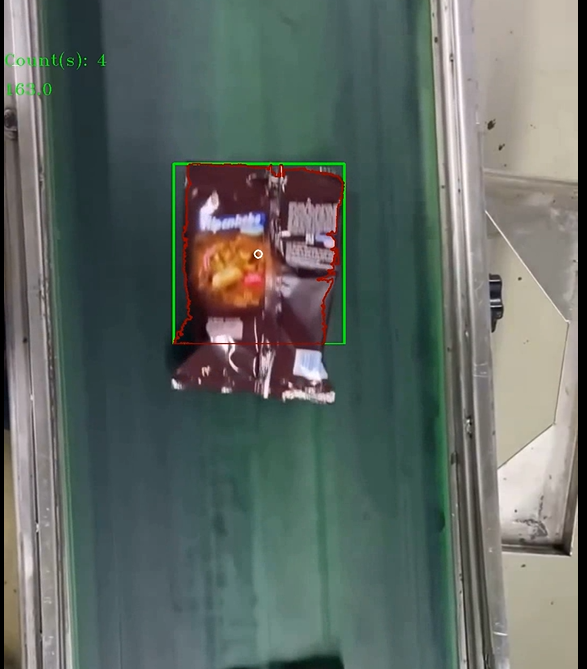
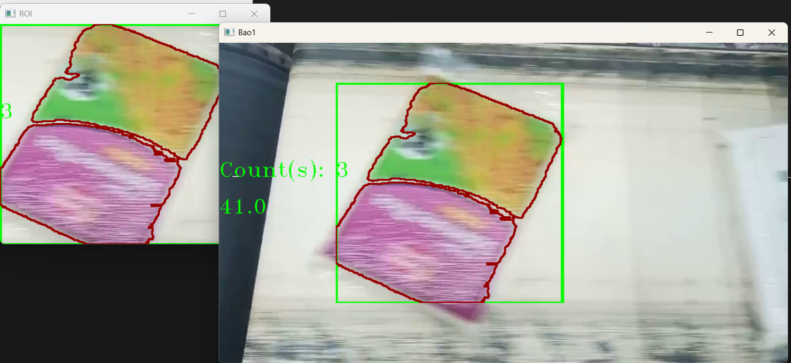

## Rice Bag Detection System for Industrial Automation

🧠 This project delivers a real-time **computer vision solution** for automated **detection, segmentation, and counting** of rice bags on a conveyor system, tailored for industrial packaging environments.

### 🛠️ Key Capabilities

* **Accurate object detection** with bounding boxes for tracking rice bags
* **Contour-based segmentation** to analyze shape and orientation
* **Automated counting** for throughput monitoring and reporting

### 🚀 Industrial Relevance

* Enhances **quality assurance** by identifying deformed or misaligned packages
* Supports **real-time decision-making** in high-speed production lines
* Enables **integration with PLCs and sorting systems** for full automation

### Take a look of the example outputs: 

